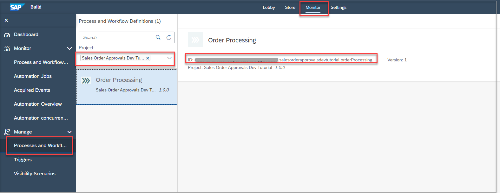
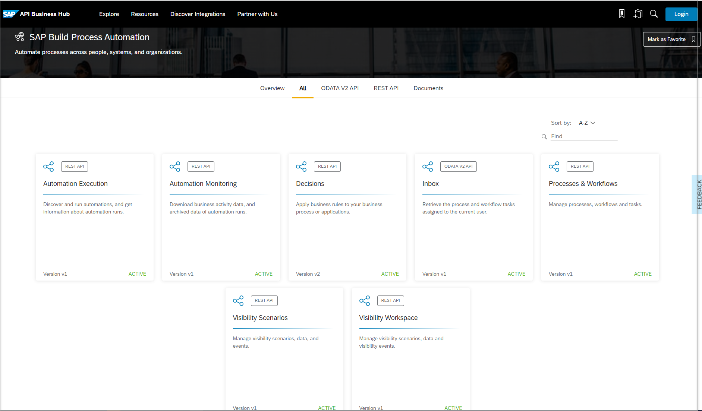
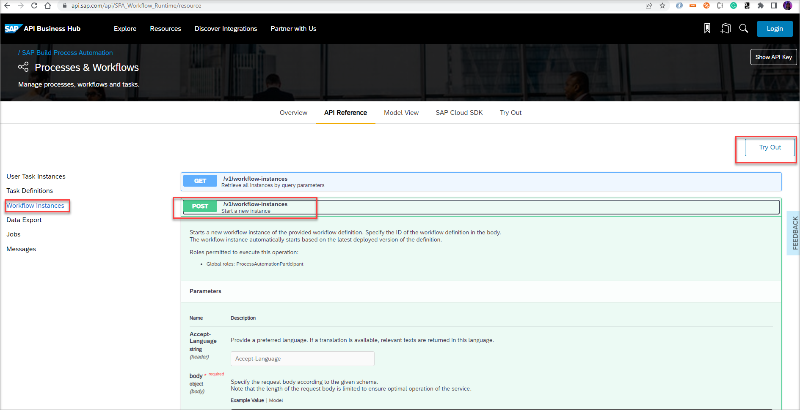
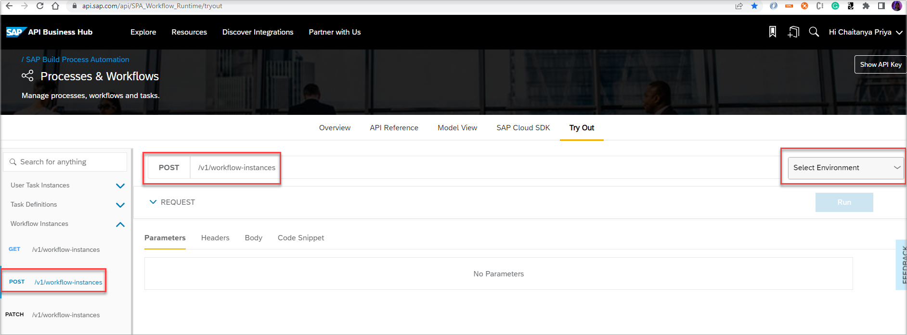
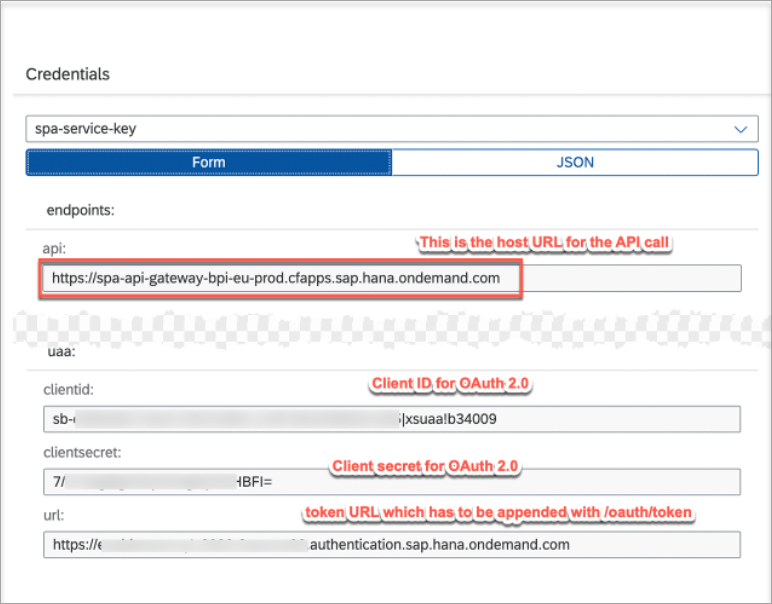
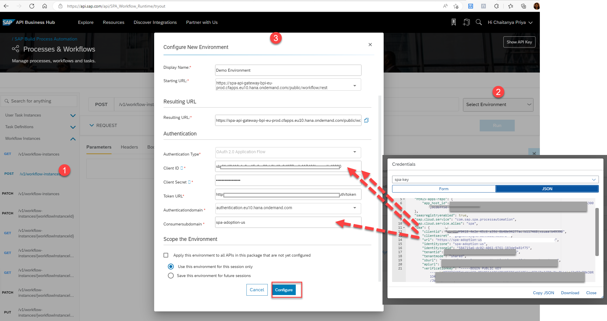
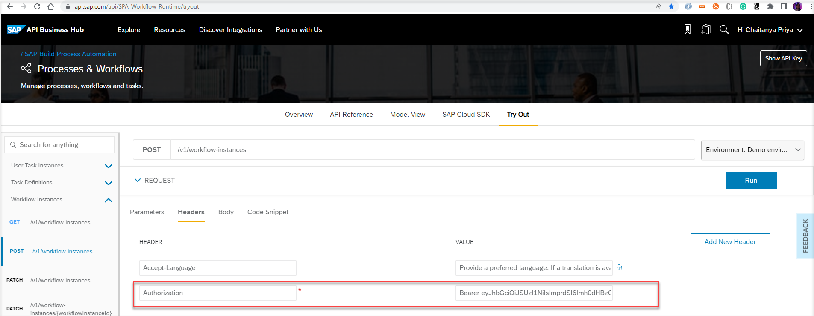
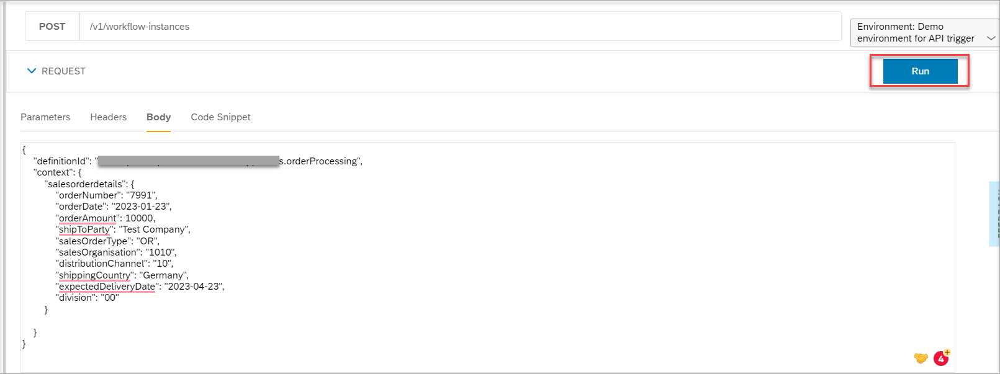
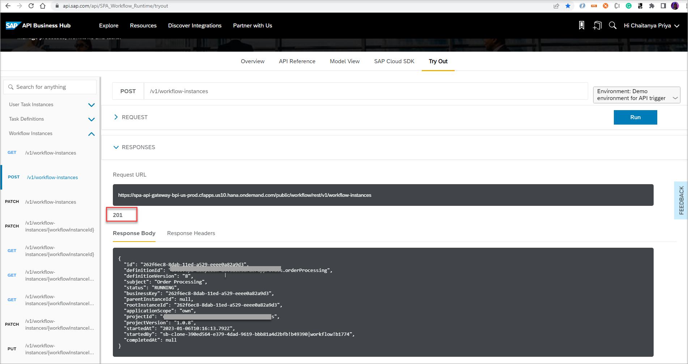

# Test An API Trigger For A Business Process
<!-- description --> Trigger business process from other services.

## Prerequisites
 - Complete [Create An API Trigger For Business Process ](spa-create-process-api-trigger.md)
 - Complete [Create Service Key For Build Process Automation](spa-create-service-instance-destination.md)

## You will learn
- How to test an API trigger for a business process

---

### View an API trigger for the process

Once you have successfully deployed the business process with an API trigger, you can view the API trigger in the **Overview** section under the tab **Triggers**.

1. Click **View** to see context of the workflow API.

    <!-- border -->

    Copy the payload which would be used in the later steps.

2. You can view the API URL and the payload to start the process.

    <!-- border -->  

    Details of the payload:

    |  **Name**    | **Details**
    |  :------------- | :-------------
    |  `definitionId`       | ID of the process after it is deployed
    |  `salesorderdetails`       | Input parameter for the API trigger

  You can even get the process `definitionId` from the **Monitor** section as shown below.

  <!-- border -->

### Create demo environment to test API trigger

All Process Automation APIs (except Inbox APIs which are OData v2 API) are REST APIs that are based on OAuth 2.0 and other methods like API keys.

1. Login to [SAP API Business Hub](https://api.sap.com/package/SAPProcessAutomation/all) to explore them.

    <!-- border -->

2. To trigger the process with an API Trigger, choose **Processes and Workflows** instances.

    <!-- border -->

3. Select **API Reference**, and then navigate to **Workflow Instances** > **POST** > **Try out**.

    <!-- border -->

4. Let's create a demo environment to test the API. Choose **Select Environment**.

    <!-- border -->

    Map the credentials of the service key that you have created  for SAP Build Process Automation as mentioned in **pre-requisites**.

    <!-- border -->

    | Field|Value
    | --- | :---
    | Client ID | Client ID from the Service key credentials
    | Client Secret | Client Secret from the Service key credentials
    | Token Service URL|  `url/oauth/token`, where `url` is noted from Service key credentials

    
    <!-- border -->

5. After successful creation of demo environment, the token for the API call would be added to the header section.

    <!-- border -->  

### Test API trigger for the process

1. Copy the payload that you copied in Step 1 of section **View an API trigger for the process** and paste it as shown below.

    <!-- border -->  

    The payload looks as below before execution of the API. Choose **Run** to trigger the API, which would start your process.

    <!-- border -->

2.  You can see the status code of the API as **201**, which is success, meaning the process was triggered.

    <!-- border -->

### Monitor the triggered process in Home Page

In the home page of SAP Build Process Automation tenant, navigate to **Monitor** > **Process and Workflow instances** to view the running instance of your process that was triggered from API call.

  <!-- border -->

---
